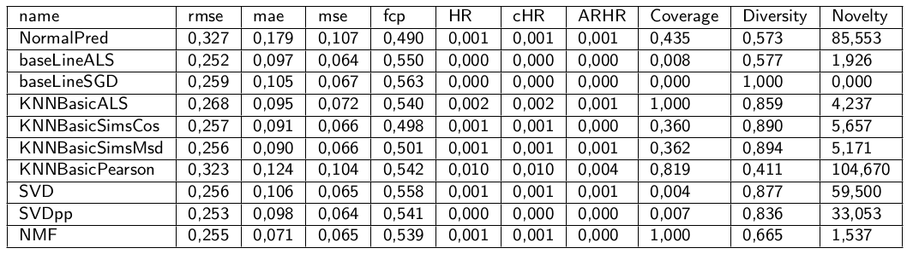

# Sceptic
Recommender Systems
Dans la branche **master** :

Le fichier [preprocessing](https://github.com/sha-cmd/Sceptic/blob/master/src/preprocessing.py) contient le nettoyage des data. Il produit notamment la base de données database.csv à partir du répertoire de 300 fichiers de clics des clients.

Le fichier [machine learning](https://github.com/sha-cmd/Sceptic/blob/master/src/machine_learning.py) produit tous les tests pour la sélection de nos algorithmes basés dont les résultats sont ci-dessous.

Le fichier [recommender system](https://github.com/sha-cmd/Sceptic/blob/master/src/rec_sys.py) est celui qui permettra de construire la base de données des recommendations pour les clients que nous connaissons assez bien, soit près de 4000, à travers 3000 livres, mais n’est pas computable sur GPU avec la bibliothèque Surprise.

De plus les [métriques](https://github.com/sha-cmd/Sceptic/blob/master/src/objects/Metrics.py) sont répertoriées de manière didactique, dans un seul objet.

Dans la branche **Collaborative_filtering** :

Nous avons aussi testé l’algorithme par [content based](https://github.com/sha-cmd/Sceptic/blob/master/src/objects/CB.py). 

Pour finir nous avons testé l’algorithme par [collab filter](https://github.com/sha-cmd/Sceptic/blob/master/src/objects/CF.py), dont le réseau neuronal est écrit dans [ce fichier](https://github.com/sha-cmd/Sceptic/blob/master/src/objects/RecommenderNet.py).

